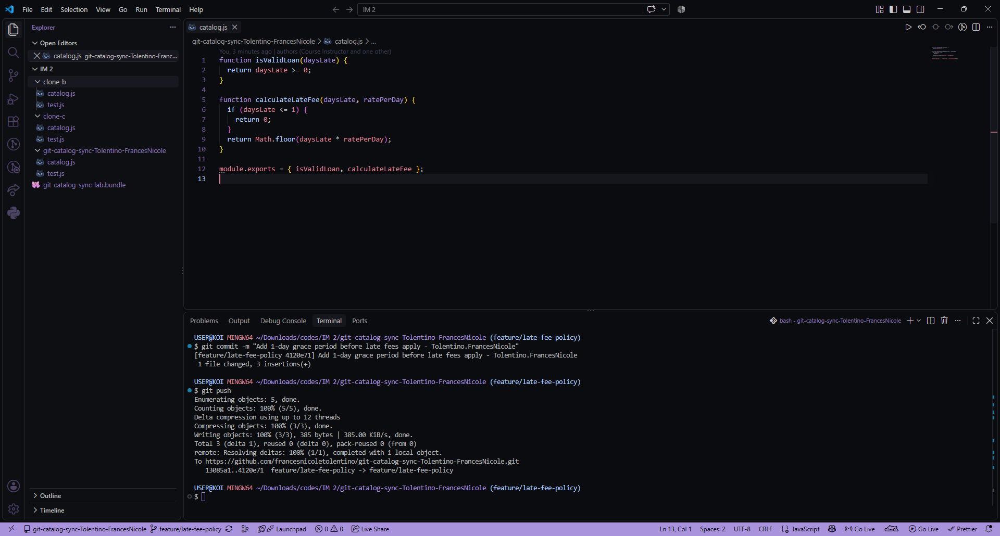
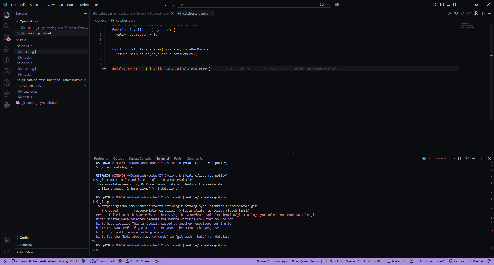
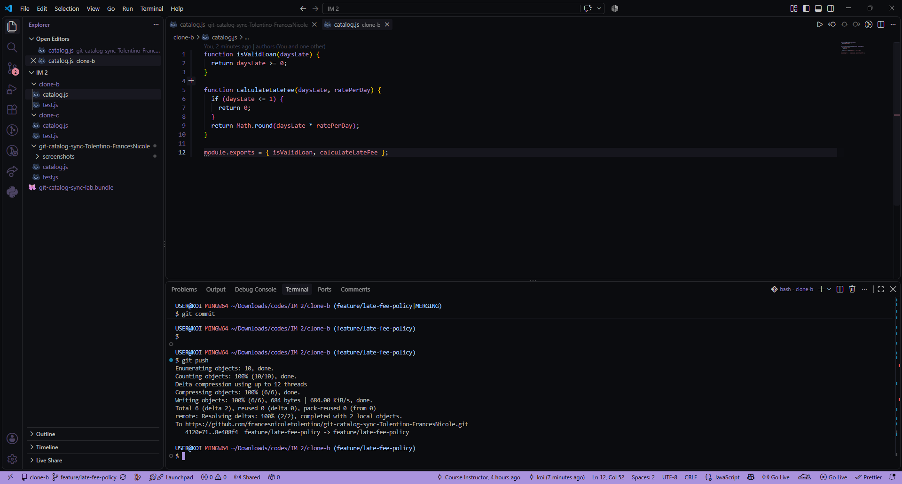
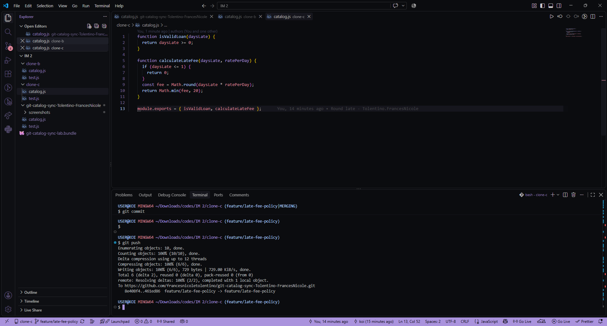
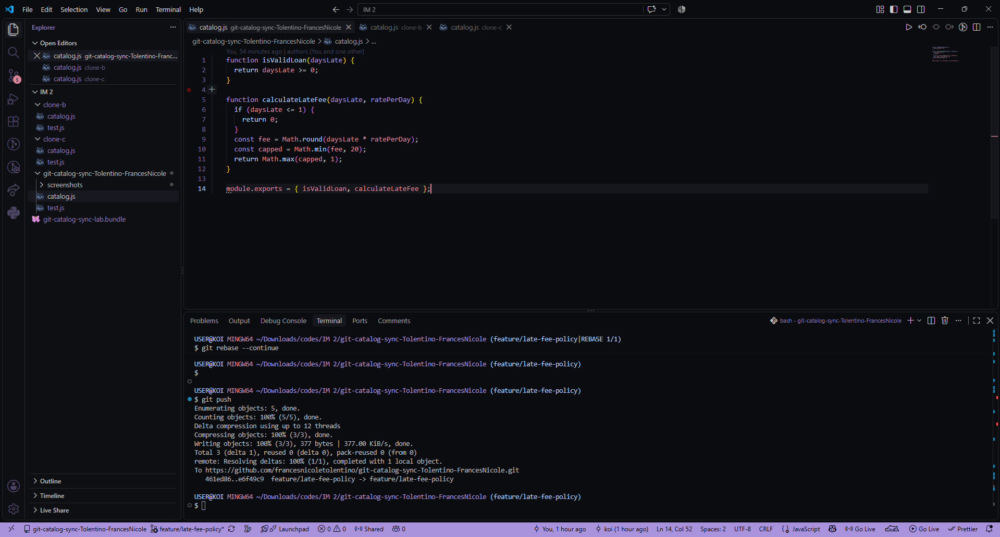
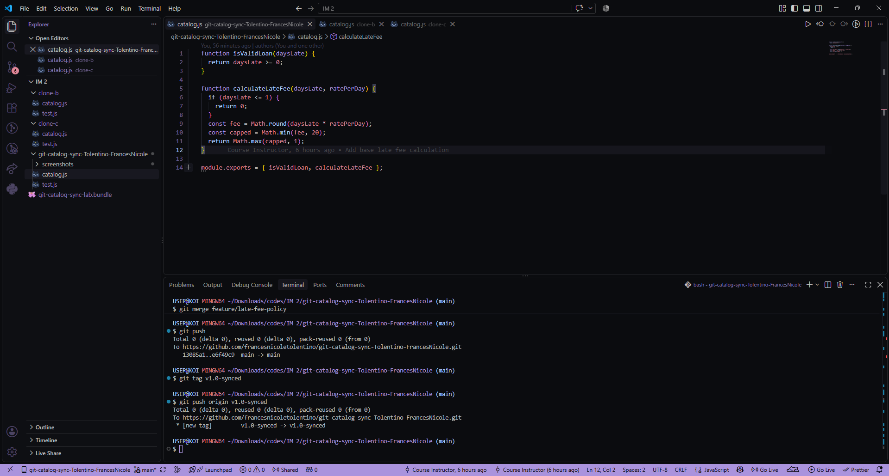

Name: Tolentino, Frances Nicole

Task 1

Task 2

Task 3

Task 4

Task 5

Task 6

Task 7

Written Answers

1. Walk through the final calculateLateFee function and name which contributor's change is responsible for each part.

function calculateLateFee(daysLate, ratePerDay) {
  if (daysLate <= 1) {
    return 0;
  }
  const fee = Math.round(daysLate * ratePerDay);
  const capped = Math.min(fee, 20);
  return Math.max(capped, 1);
}

The if (daysLate <= 1) return 0 part is the grace period, which I added first in Clone A during Task 1.
Math.round(daysLate * ratePerDay) is the rounding fix, which I did in Clone B during Task 2 and 3.
Math.min(fee, 20) is the $20 cap, from Clone C in Task 4 and 5.
And Math.max(capped, 1) is the $1 minimum, which I went back and added in Clone A again during Task 6.

2. Compare Task 3's two-way conflict to Task 5's three-way conflict, what got harder with a third line of work?

Task 3 was pretty simple, it was just my rounding change against one other change, so it was basically pick-one-or-the-other. Task 5 threw me off more because by that point the other side of the conflict wasn't just one change anymore, it was already a combination of two things Clone B had merged together. I had to actually understand what that merged block was doing before I could even figure out where my $20 cap was supposed to go in it.

3. What's the actual difference between how you resolved Task 5 with a merge and Task 6 with a rebase?

With the merge in Task 5, git made a new commit that basically says "these two branches came together here" and keeps both histories as they actually happened. With the rebase in Task 6, there was no merge commit at all, it just took my $1 minimum change and replayed it like I'd written it on top of the already-updated code from the start. My commit even got a new hash after that happened, which threw me off a bit at first.

4. If this were a real team of three, what one process change would have prevented all three rejected pushes?

Honestly, just pulling before starting to work. Every single rejected push happened because I started editing without checking what was already on the remote first. If that was just a habit before touching any code, none of the pushes would've gotten rejected in the first place.